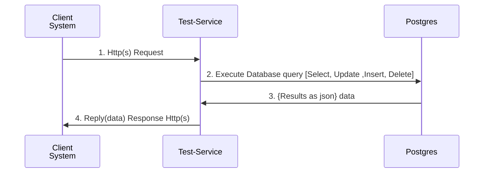

<!-- SPDX-License-Identifier: Apache-2.0 -->
# Test Service Documentation

## Overview

The **Test Service** is a Node.js-based API designed for testing of Tazama tasks, with a particular focus on postgres row management. It utilizes the Fastify framework to deliver a high-performance and low-overhead API interface. This document offers an in-depth examination of the API, covering setup requirements, a comprehensive overview of the application, and detailed route documentation.

## Pre-requisites

Before you start using the Test API, ensure that you have the following items:

1. **Node.js**: Version 20.x or higher.
    - Download from [Node.js Official Website](https://nodejs.org/).
    - Verify installation using `node -v` and `npm -v`.

2. **NPM**: A package manager for Node.js packages.
    - NPM is installed with Node.js.

3. **Git**: Version control system for cloning the repository.
    - Download from [Git Official Website](https://git-scm.com/).

4. **Database**: Postgres database setup.
    - Ensure the database is running and accessible from your Node.js environment.

5. **Environment Variables**: Set up environment variables required by the application, such as database connection strings. Typically stored in a `.env` file.

## Installation and Setup

1. **Clone the Repository**:
    ```bash
    git clone https://github.com/@frmscoe/test-service.git
    cd test-service
    ```

2. **Install Dependencies**:
    ```bash
    npm install
    ```

3. **Configure Environment Variables**:
    - Create a `.env` file in the root directory and add necessary configuration values

4. **Run the Server**:
    ```bash
    npm run start
    ```

5. **Access the API**:
    - The server runs on `http://localhost:PORT` by default. You can access the API via your browser or any HTTP client like Postman.

## API Endpoints

### 1. General Endpoint of test-service 

#### Description
All Object in the database are supported with 4 different operations allowing users to interact with table's data, Select return multiple, Select return one, Insert a record, Update an already existing record, Delete by id

#### Flow Diagram


#### URL
```
LIST: /v1/test/raw_history/pacs008
GET: /v1/test/raw_history/pacs008/:id
POST: /v1/test/raw_history/pacs008
PUT: /v1/test/raw_history/pacs008/:id
DEL /v1/test/raw_history/pacs008/:id
```

#### Method
```
GET
GET
POST
PUT
DEL
```

#### Query Parameters

| Parameter | Type   | Required | Description                     | Method |
|-----------|--------|----------|---------------------------------|-----------|
| `id`   | String | Yes      | The message ID to get the report for. | LIST(GET)  |

| Path Parameter | Type   | Required | Description                     | Method |
|-----------|--------|----------|---------------------------------|---------|
| `id`   | String | Yes      | The message ID to get the report for. | PUT, GET, DELETE |

| Body | Type   | Required | Description                     | Method |
|-----------|--------|----------|---------------------------------|----------|
| `{}`   | Object | Yes      | The message ID to get the report for. | POST, PUT |

#### Headers
No specific headers required apart from standard authentication headers if needed.

### Request Example
```http
GET /v1/test/raw_history/pacs002/1234567890 HTTP/1.1
```

